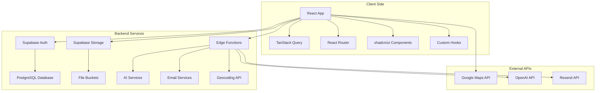
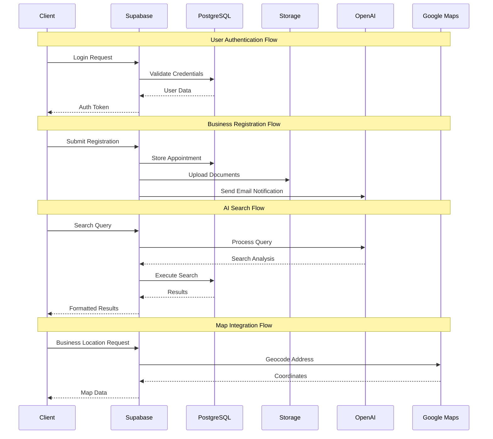
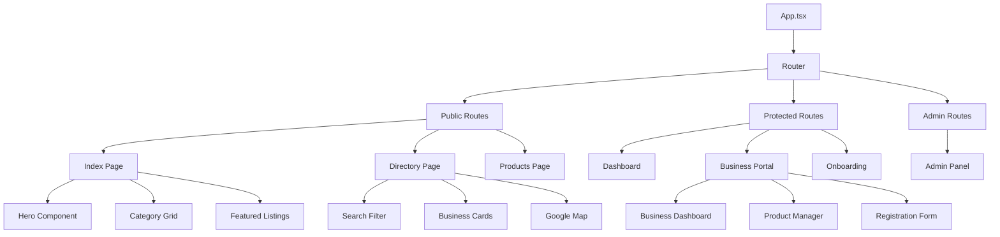
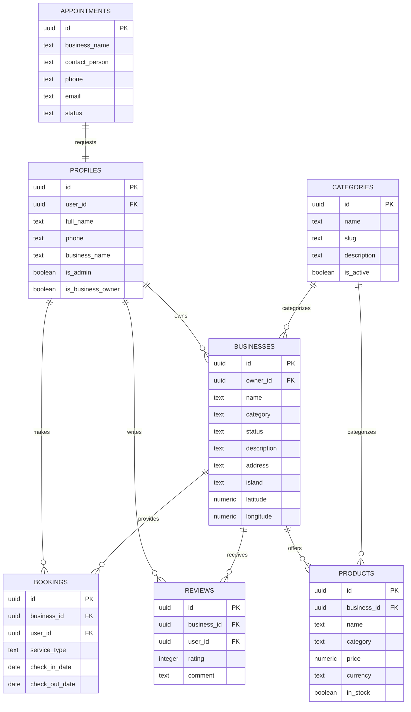
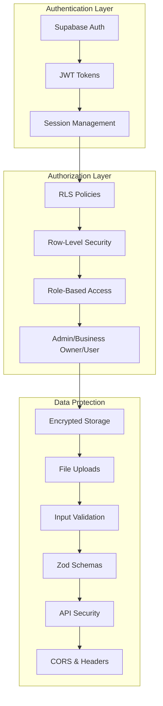
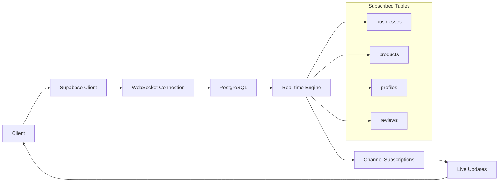
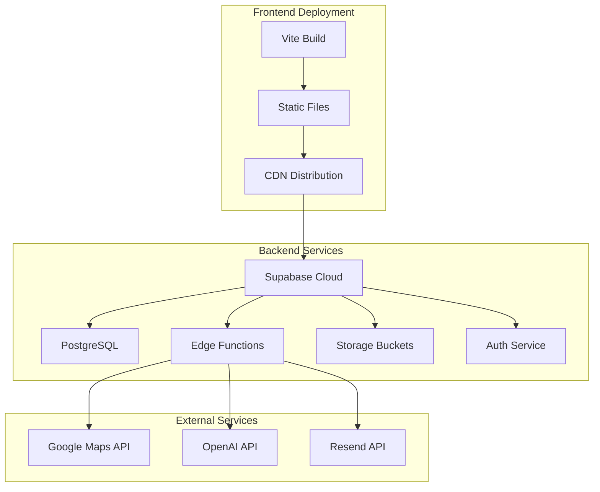

# iCompass Seychelles - Architecture Documentation

## System Overview

The iCompass Seychelles platform is built as a modern web application using React, TypeScript, and Supabase. The architecture follows a client-server pattern with real-time capabilities and AI-powered features.

## High-Level Architecture

## Data Flow Architecture

## Component Architecture

## Database Architecture

## Security Architecture

## Real-time Architecture

## Deployment Architecture

## Performance Considerations

### Frontend Optimization
- **Code Splitting**: Route-based lazy loading
- **Image Optimization**: Lazy loading and responsive images
- **Caching**: React Query for API response caching
- **Bundle Size**: Tree shaking and dead code elimination

### Backend Optimization
- **Database Indexing**: Optimized queries with proper indexes
- **Connection Pooling**: Supabase managed connection pooling
- **Edge Functions**: Serverless functions for scalability
- **CDN**: Global content delivery for static assets

### Real-time Optimization
- **Selective Subscriptions**: Only subscribe to necessary data
- **Debounced Updates**: Prevent excessive re-renders
- **Connection Management**: Automatic reconnection handling
- **Bandwidth Optimization**: Minimal data transfer
