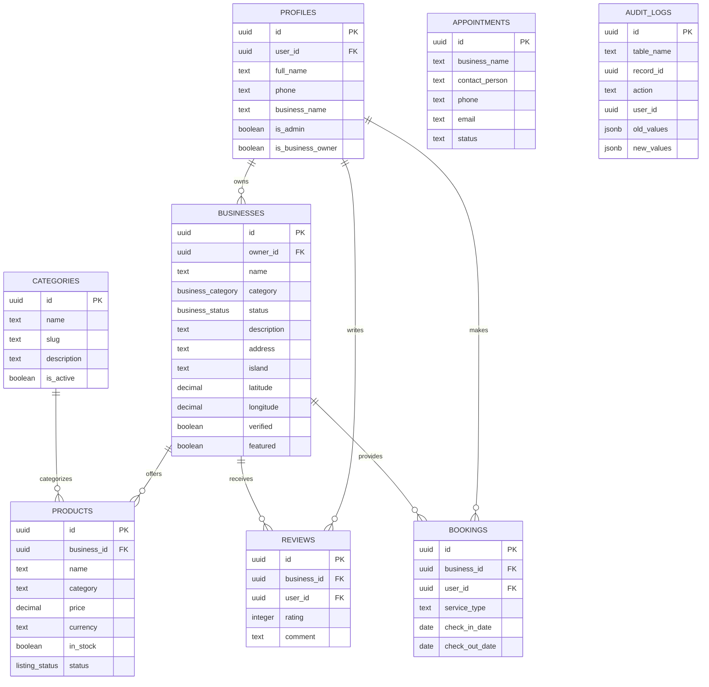

# iCompass Seychelles - Database Schema Documentation

## Overview

The iCompass Seychelles platform uses Supabase PostgreSQL with comprehensive Row Level Security (RLS) policies. This document provides detailed information about the database schema, relationships, and security policies.

## Database Tables

### Core Tables

#### `profiles`
User profiles and role management

| Column | Type | Description |
|--------|------|-------------|
| id | uuid (PK) | Primary key |
| user_id | uuid (FK) | References auth.users |
| full_name | text | User's full name |
| phone | text | Contact phone number |
| avatar_url | text | Profile image URL |
| business_name | text | Associated business name |
| is_business_owner | boolean | Business owner status |
| is_admin | boolean | Admin privileges |
| created_at | timestamptz | Creation timestamp |
| updated_at | timestamptz | Last update timestamp |

#### `businesses`
Main business entity storage

| Column | Type | Description |
|--------|------|-------------|
| id | uuid (PK) | Primary key |
| owner_id | uuid (FK) | References profiles.id |
| name | text | Business name |
| description | text | Business description |
| category | business_category | Business category enum |
| status | business_status | Status enum (active/pending/suspended/closed) |
| phone | text | Contact phone |
| whatsapp | text | WhatsApp number |
| email | text | Contact email |
| website | text | Business website |
| facebook_url | text | Facebook page URL |
| instagram_url | text | Instagram profile URL |
| linkedin_url | text | LinkedIn profile URL |
| youtube_url | text | YouTube channel URL |
| address | text | Physical address |
| island | text | Seychelles island |
| latitude | decimal(10,8) | GPS latitude |
| longitude | decimal(11,8) | GPS longitude |
| opening_hours | jsonb | Opening hours configuration |
| featured | boolean | Featured business flag |
| verified | boolean | Verification status |
| logo_url | text | Logo image URL |
| cover_image_url | text | Cover image URL |
| gallery_images | text[] | Array of gallery image URLs |
| services | text[] | Array of services offered |
| average_rating | decimal(3,2) | Calculated average rating |
| total_reviews | integer | Total number of reviews |
| created_at | timestamptz | Creation timestamp |
| updated_at | timestamptz | Last update timestamp |

#### `products`
Business offerings and inventory

| Column | Type | Description |
|--------|------|-------------|
| id | uuid (PK) | Primary key |
| business_id | uuid (FK) | References businesses.id |
| name | text | Product name |
| description | text | Product description |
| category | text | Product category |
| unit | text | Unit of measurement |
| sku | text | Stock keeping unit |
| price | decimal(10,2) | Product price |
| currency | text | Currency code (default: SCR) |
| images | text[] | Array of product image URLs |
| catalogue_url | text | Product catalog URL |
| in_stock | boolean | Stock availability |
| stock_quantity | integer | Available quantity |
| featured | boolean | Featured product flag |
| status | listing_status | Status enum (active/draft/pending/expired) |
| tags | text[] | Product tags |
| published_at | timestamptz | Publication timestamp |
| created_at | timestamptz | Creation timestamp |
| updated_at | timestamptz | Last update timestamp |

#### `reviews`
Customer feedback system

| Column | Type | Description |
|--------|------|-------------|
| id | uuid (PK) | Primary key |
| business_id | uuid (FK) | References businesses.id |
| user_id | uuid (FK) | References profiles.id |
| rating | integer | Rating (1-5) with CHECK constraint |
| comment | text | Review comment |
| helpful_count | integer | Helpful votes count |
| created_at | timestamptz | Creation timestamp |
| updated_at | timestamptz | Last update timestamp |
| UNIQUE(business_id, user_id) | | One review per user per business |

#### `bookings`
Service booking system

| Column | Type | Description |
|--------|------|-------------|
| id | uuid (PK) | Primary key |
| business_id | uuid (FK) | References businesses.id |
| user_id | uuid (FK) | References profiles.id |
| service_type | text | Type of service (accommodation/tour/rental) |
| check_in_date | date | Check-in date |
| check_out_date | date | Check-out date |
| guests | integer | Number of guests |
| total_price | decimal(10,2) | Total booking price |
| currency | text | Currency code (default: SCR) |
| booking_details | jsonb | Additional booking details |
| status | text | Booking status (default: pending) |
| created_at | timestamptz | Creation timestamp |
| updated_at | timestamptz | Last update timestamp |

#### `appointments`
Business registration requests

| Column | Type | Description |
|--------|------|-------------|
| id | uuid (PK) | Primary key |
| business_name | text | Requested business name |
| contact_person | text | Contact person name |
| phone | text | Contact phone |
| whatsapp | text | WhatsApp number |
| email | text | Contact email (nullable) |
| website | text | Business website |
| linkedin_url | text | LinkedIn URL |
| facebook_url | text | Facebook URL |
| youtube_url | text | YouTube URL |
| instagram_url | text | Instagram URL |
| preferred_date | timestamptz | Preferred appointment date |
| preferred_time | text | Preferred appointment time |
| notes | text | Additional notes |
| status | text | Appointment status (default: pending) |
| created_at | timestamptz | Creation timestamp |
| updated_at | timestamptz | Last update timestamp |

#### `categories`
Business category definitions

| Column | Type | Description |
|--------|------|-------------|
| id | uuid (PK) | Primary key |
| name | text | Category name (unique) |
| slug | text | URL-friendly slug (unique) |
| description | text | Category description |
| is_active | boolean | Active status |
| created_at | timestamptz | Creation timestamp |
| updated_at | timestamptz | Last update timestamp |

#### `audit_logs`
System activity tracking

| Column | Type | Description |
|--------|------|-------------|
| id | uuid (PK) | Primary key |
| table_name | text | Name of modified table |
| record_id | uuid | ID of modified record |
| action | text | Action performed (INSERT/UPDATE/DELETE) |
| user_id | uuid | User who performed action |
| old_values | jsonb | Previous values |
| new_values | jsonb | New values |
| created_at | timestamptz | Action timestamp |

## Enums

### `business_category`
- restaurants
- hotels
- tourism
- retail
- services
- entertainment
- health
- education
- finance
- transport
- real_estate
- technology

### `business_status`
- active
- pending
- suspended
- closed

### `listing_status`
- active
- draft
- pending
- expired

## Database Functions

### Security Functions
- `is_admin()` - Check if current user has admin privileges
- `can_view_review_profile(target_user_id)` - Privacy-aware profile access for business owners

### Automation Functions
- `handle_new_user()` - Auto-create profile on user signup
- `update_updated_at_column()` - Auto-update timestamps
- `update_product_published_at()` - Manage product publication dates
- `update_business_rating()` - Recalculate business ratings on review changes
- `audit_trigger()` - Log all table changes

### Analytics Functions
- `get_live_counters()` - Real-time dashboard statistics

## Storage Buckets

### Public Buckets
- **`business-logos`** - Business logo images
- **`business-covers`** - Business cover images
- **`product-images`** - Product gallery images
- **`business-documents`** - Business documentation

### Private Buckets
- **`product-catalogues`** - Private product catalogs

## Indexes

### Performance Indexes
- `idx_businesses_category` - Index on businesses.category
- `idx_businesses_status` - Index on businesses.status
- `idx_businesses_location` - Index on businesses(latitude, longitude)
- `idx_products_business_id` - Index on products.business_id
- `idx_products_category` - Index on products.category
- `idx_products_status` - Index on products.status
- `idx_products_published_at` - Index on products.published_at
- `idx_products_tags` - GIN index on products.tags
- `idx_bookings_user_id` - Index on bookings.user_id
- `idx_bookings_business_id` - Index on bookings.business_id
- `idx_reviews_business_id` - Index on reviews.business_id

## Relationships

### Primary Relationships
- `profiles` → `businesses` (one-to-many)
- `businesses` → `products` (one-to-many)
- `businesses` → `reviews` (one-to-many)
- `profiles` → `reviews` (one-to-many)
- `businesses` → `bookings` (one-to-many)
- `profiles` → `bookings` (one-to-many)
- `categories` → `products` (one-to-many via slug)

### Foreign Key Constraints
- All foreign keys have proper CASCADE rules
- Deletion of profiles cascades to businesses
- Deletion of businesses cascades to products and reviews
- Referential integrity maintained across all relationships

## Entity Relationship Diagram

## Data Validation

### Check Constraints
- Rating values must be between 1 and 5 (reviews table)
- Email addresses validated at application level
- Phone numbers follow Seychelles format
- Price values must be positive
- Date values must be logical (check-out after check-in)

### Triggers
- Automatic timestamp updates on all tables
- Business rating recalculation on review changes
- Audit logging on all data modifications
- Profile creation on user signup
- Product publication date management

## Real-time Features

### Replica Identity
- `businesses` - FULL replica identity for real-time updates
- `products` - FULL replica identity for real-time updates
- `categories` - FULL replica identity for real-time updates
- `profiles` - FULL replica identity for real-time updates
- `reviews` - FULL replica identity for real-time updates

### Realtime Publication
All core tables are added to `supabase_realtime` publication for live updates.

## Sample Data

The database includes sample data for testing:
- 3 sample business owners
- 2 sample businesses (Paradise Resort & Spa, Seychelles Adventures Tours)
- 2 sample products per business
- Sample reviews for testing the rating system

## Security Considerations

- All tables have Row Level Security (RLS) enabled
- Comprehensive RLS policies control data access
- Security definer functions for complex permission checks
- Audit logging for all data modifications
- Proper foreign key constraints with CASCADE rules
- Input validation at both database and application levels
